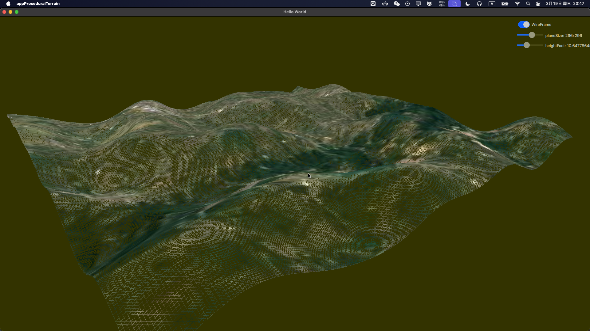

## 程序化地形渲染

### Part1

* 使用QQuickFramebufferObject接口调用OpenGL的API绘制图形。
* 使用Quick3D模块的OrbitCameraController和PerspectiveCamera组件实现相机系统。

 

### Part2

* 添加一个Plane生成器，可以自定义大小，平面由单位长度为1的quad组成。
* 通过FastNoiseLite库生成Plane每个坐标点的高度，模拟地势起伏。

 

 

